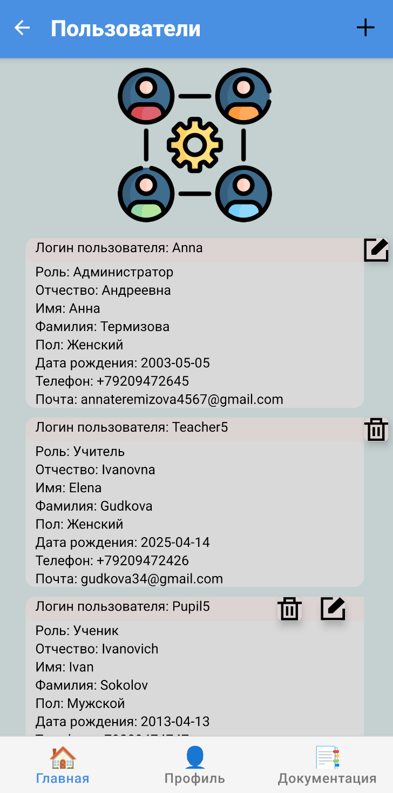
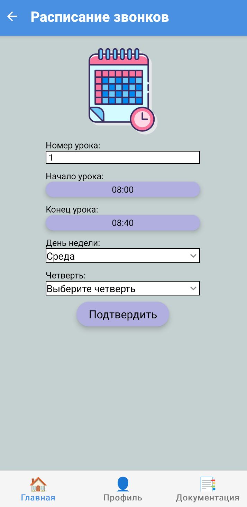
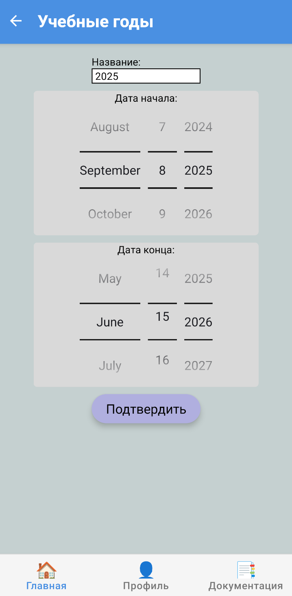

**[← Back](./README.md)**

# 🛠️ Интерфейс администратора

Панель администратора предоставляет доступ ко всем ключевым разделам системы «Электронный журнал». Здесь администратор может управлять пользователями, кабинетами, предметами, учебными годами, расписаниями и многим другим.

---

## 🖥️ Главный экран

На главном экране администратора представлена сводная информация:

- Список кабинетов
- Учебные годы
- Пользователи
- Предметы
- Четверти
- Уроки и темы
- Расписание уроков
- Расписание звонков

---

## 🏫 Кабинеты

Раздел для управления школьными кабинетами: добавление, редактирование, удаление.

---

## 👤 Пользователи

Список всех зарегистрированных пользователей: учителя, ученики, родители и администраторы.

---

## 📚 Предметы

Здесь администратор может управлять списком учебных дисциплин, назначать учителей и привязывать к классам.

---

## ⏰ Расписание звонков

Управление временем начала и окончания уроков. Полезно для настройки расписаний классов и учителей.

---

## 📅 Учебные годы

Администратор задаёт учебные периоды, к которым будут привязаны классы, четверти и расписания.
