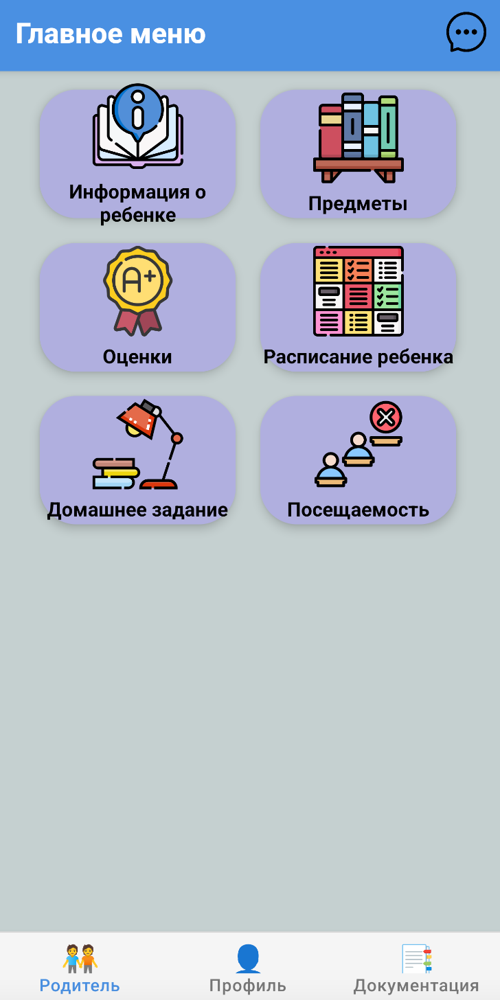
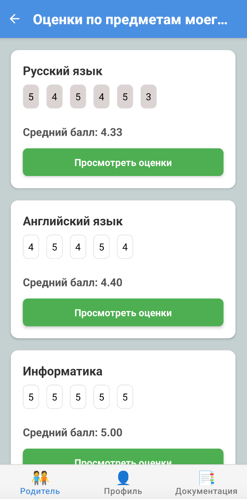
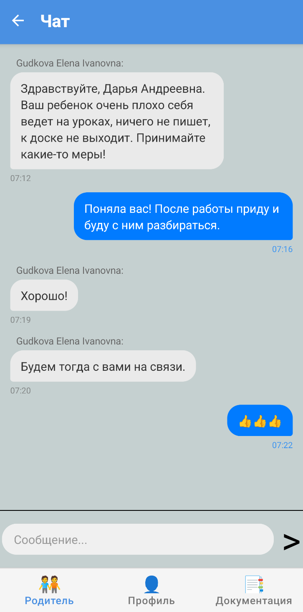
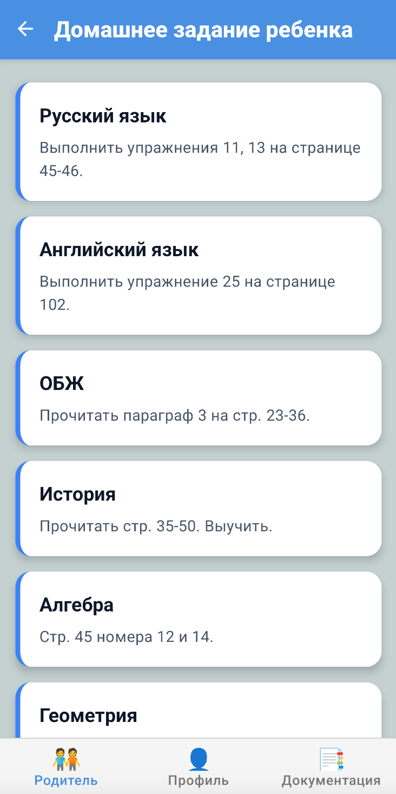
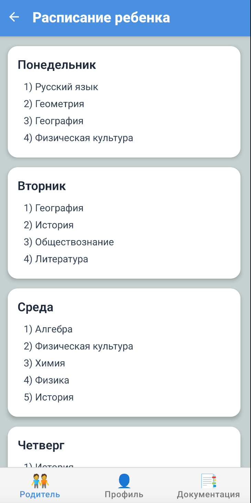
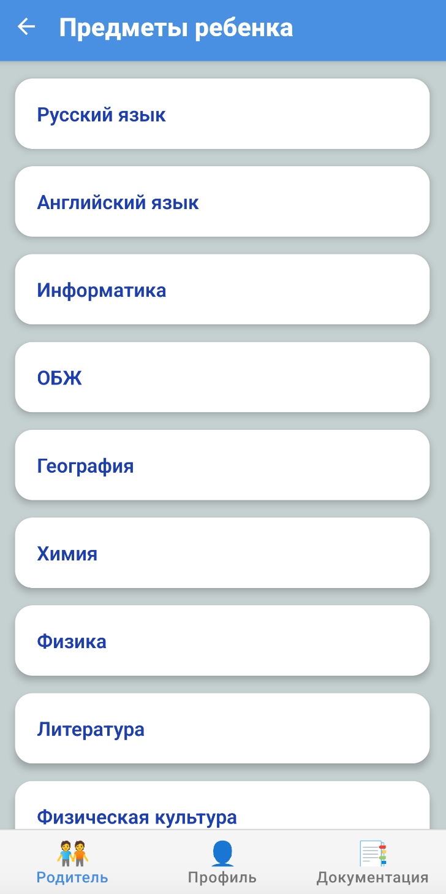

**[← Back](./README.md)**

# 👨‍👩‍👧 Интерфейс родителя

Интерфейс родителя создан для того, чтобы обеспечить полный контроль над учебным процессом ребёнка. Родители могут отслеживать успеваемость, посещаемость, получать уведомления о домашних заданиях и вести общение с учителями через встроенный чат.

---

## 🏠 Главное меню

Главная страница интерфейса родителя содержит навигацию к ключевым разделам: оценки, расписание, домашние задания, предметы и чат.

---

## 📝 Оценки

Раздел с подробной информацией об успеваемости ребёнка: оценки по каждому предмету, комментарии от учителей, динамика за четверти и учебный год.

---

## 💬 Чат

Позволяет родителям оперативно связаться с преподавателями, задать вопросы и получить обратную связь по успеваемости или поведению ученика.

---

## 🏡 Домашнее задание

Список всех назначенных домашних заданий с указанием предмета, дедлайна и статуса выполнения.

---

## 🗓️ Расписание ребёнка

Полный обзор текущего расписания ученика. Родитель может видеть, какие уроки и в какое время проходят у ребёнка в течение дня.

---

## 📚 Предметы

Список предметов, которые изучает ребёнок. Возможен просмотр успеваемости и активности по каждому из них.

