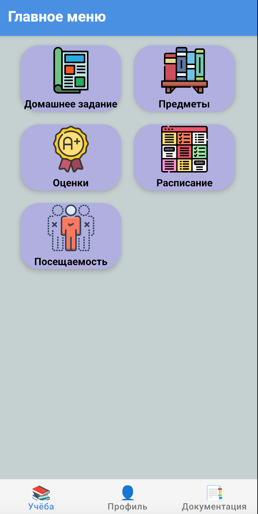
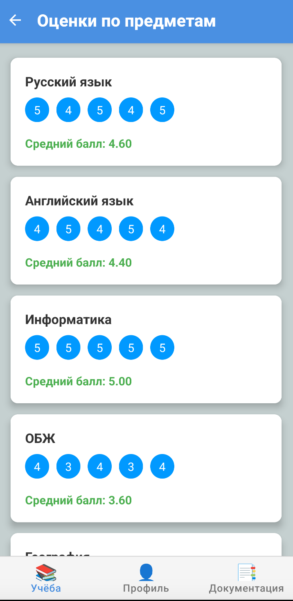
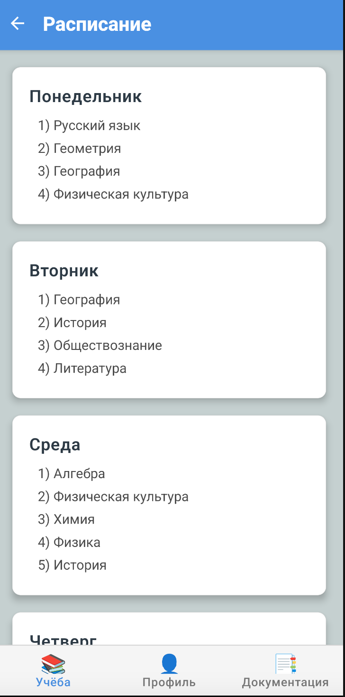
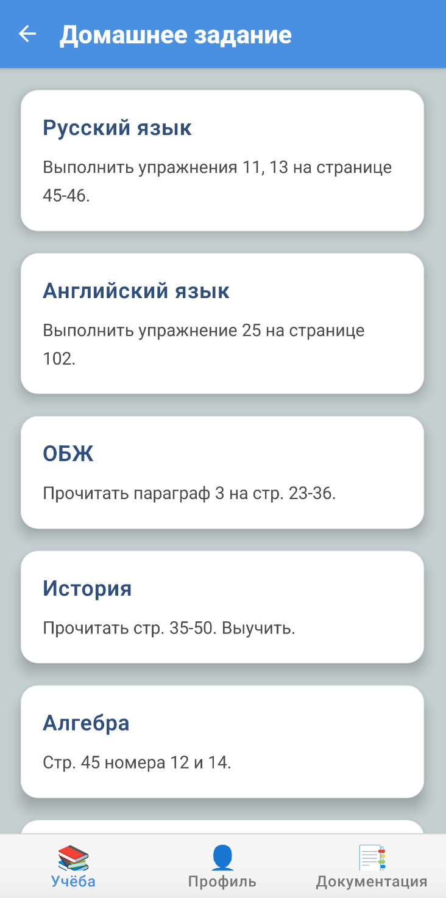
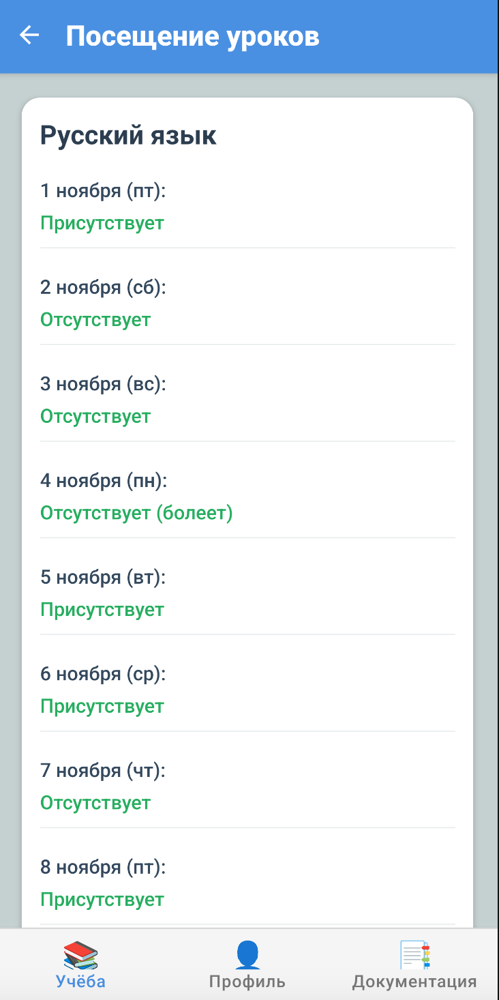

**[← Back](./README.md)**

# 🎓 Интерфейс ученика

Главный экран ученика предоставляет доступ ко всем ключевым разделам, необходимым для отслеживания учебного процесса. Учащийся может просматривать расписание, домашние задания, успеваемость и посещаемость.

---

## 🏠 Главное меню

Основная панель ученика, с которой начинается работа в системе: отображаются основные разделы — оценки, задания, расписание и посещаемость.

---

## 📊 Оценки

Раздел, где отображаются все текущие оценки по предметам. Предусмотрена возможность просмотра оценок за определённые периоды (четверть, год и т.д.).

---

## 🗓️ Расписание

Показывает актуальное расписание уроков на текущий день или неделю. Ученик может отслеживать, в каком кабинете и с каким преподавателем будет следующий урок.

---

## 📝 Домашние задания

Здесь ученик видит список выданных домашних заданий с указанием дедлайнов, статуса выполнения и комментариев от преподавателей.

---

## ✅ Посещаемость

Отображается статистика посещаемости: количество пропущенных уроков, опозданий и причина отсутствия (если указана).
