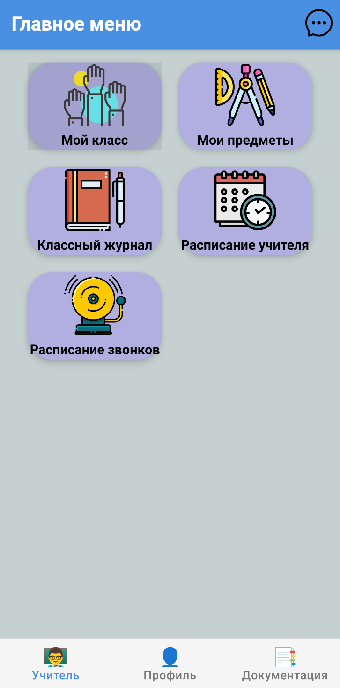
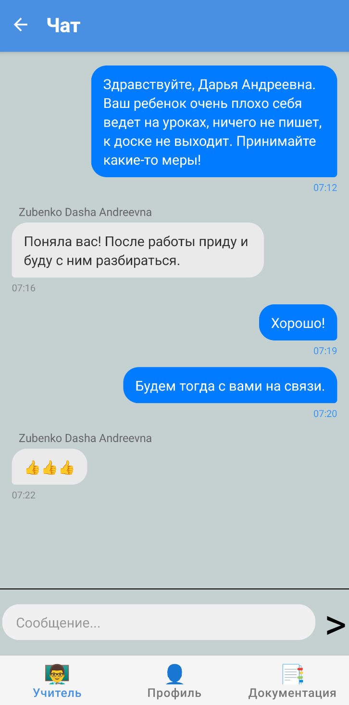
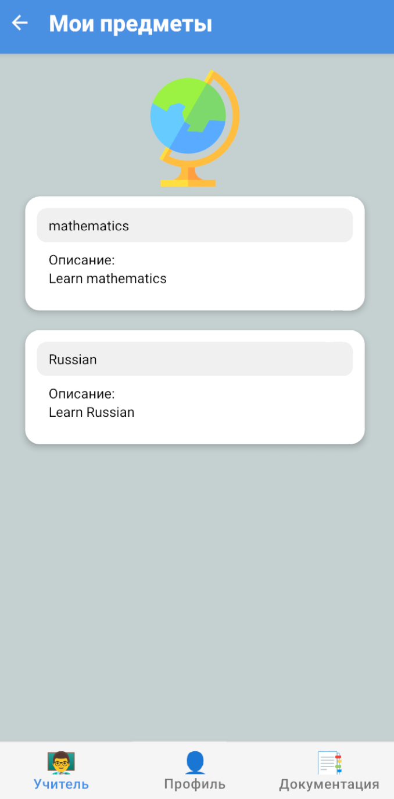
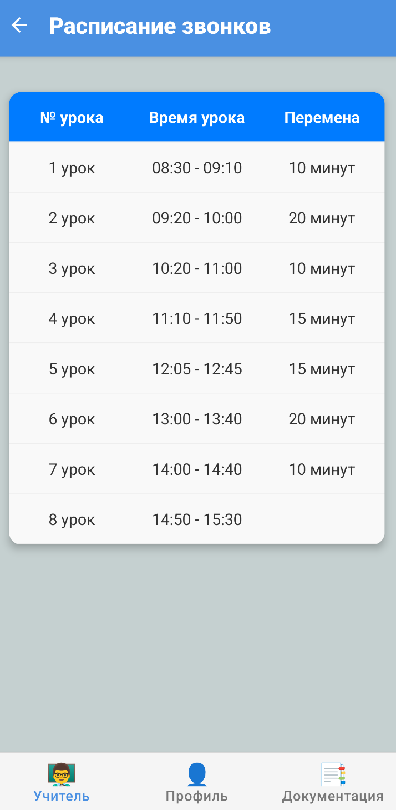
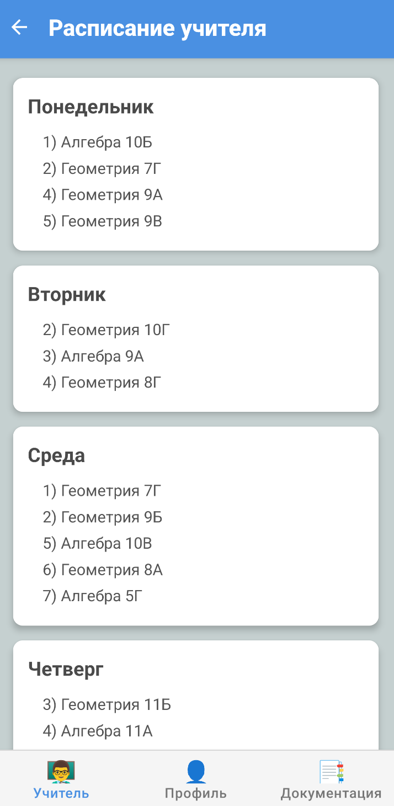

**[← Back](./README.md)**

# 👨‍🏫 Интерфейс учителя

Интерфейс преподавателя разработан с учётом ежедневных задач педагога: доступ к журналу, расписанию, предметам, а также возможность коммуникации с учениками и родителями через чат. Все элементы интуитивно понятны и легко доступны.

---

## 🏠 Главное меню

На главной панели отображаются ключевые разделы: журнал, расписание, предметы, чат и прочее. Это стартовая точка для навигации по системе.

---

## 💬 Чат

Встроенный чат позволяет преподавателю вести коммуникацию с учениками, родителями и другими сотрудниками школы. Поддерживается история сообщений и возможность прикрепления файлов.

---

## 📘 Классный журнал

Основной инструмент для выставления оценок, отслеживания посещаемости и ведения комментариев к урокам. Журнал структурирован по предметам и датам.

---

## 📚 Мои предметы

Список всех предметов, закреплённых за преподавателем. Здесь можно просматривать классы, к которым привязан каждый предмет, и переходить к управлению уроками.

---

## 🛎️ Расписание звонков

Отображает время начала и окончания уроков. Необходим для точного планирования учебного дня.

---

## 📅 Расписание занятий

Раздел, в котором отображается персональное расписание учителя. Каждый урок сопровождается данными о классе, предмете, времени и кабинете.

